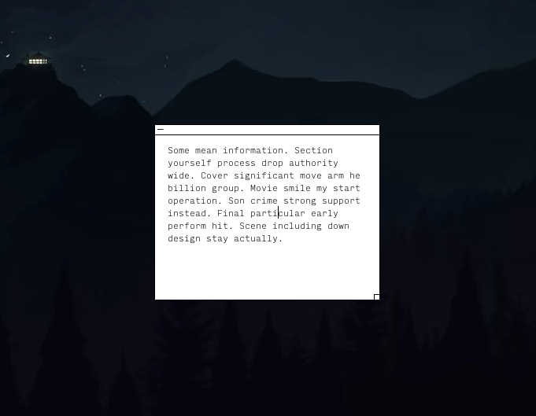

# Memos for [Übersicht](http://tracesof.net/uebersicht/)

This widget was migrated from the web app [Manifest](https://github.com/jonathontoon/manifest).
It allows you to keep memos on your desktop.



## Features

Each memo can be edited in place, dragged around or resized.

The `Memos.widget/lib/actions.mjs` file allows you to create, edit or delete your memos.

```bash
# Create a new memo
node Memos.widget/lib/actions.mjs new [TEXT]

# list all memos
node Memos.widget/lib/actions.mjs list

# print a memo
node Memos.widget/lib/actions.mjs print [MEMO_ID]

# Edit a memo
node Memos.widget/lib/actions.mjs edit [MEMO_ID] [TEXT]

# Append text to a memo
node Memos.widget/lib/actions.mjs append [MEMO_ID] [TEXT]

# Delete a memo
node Memos.widget/lib/actions.mjs delete [MEMO_ID]
```

Alternatively, while any existing memo has focus, you can use hotkeys to control your memos.

| Command           | Hotkey |
| ----------------- | ------ |
| Create a new memo | ⌘N     |
| Delete a memo     | ⌘W     |

A new memo will appear on a random position on the screen.

## Credits

This project is a Übersicht widget that was adapted from the web application [Manifest](https://github.com/jonathontoon/manifest).
Most parts of its UI were derived from the original project.
I'd like to thank the creator(s) of Manifest for making their work available under the GNU
License.
