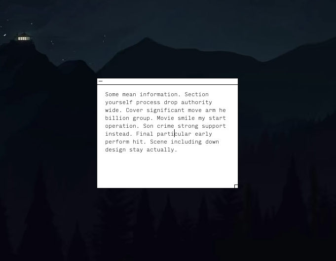

# Memos for [Übersicht](http://tracesof.net/uebersicht/)

This widget was migrated from the web app [Manifest](https://github.com/jonathontoon/manifest).
It allows you to keep memos on your desktop.



## Features

Each memo can be edited in place, dragged around or resized.

The `lib/actions.js` file allows you to create, edit or delete your memos.

```bash
# Create a new memo
node Memos.widget/lib/actions.js new [TEXT]

# list all memos
node Memos.widget/lib/actions.js list

# Edit a memo
node Memos.widget/lib/actions.js edit [MEMO_ID] [TEXT]

# Append text to a memo
node Memos.widget/lib/actions.js append [MEMO_ID] [TEXT]

# Delete a memo
node Memos.widget/lib/actions.js delete [MEMO_ID]
```

Alternatively, while any existing memo has focus, you can use hotkeys to control your memos.

| Command           | Hotkey |
| ----------------- | ------ |
| Create a new memo | ⌘N     |
| Delete a memo     | ⌘W     |

A new memo will appear at a random position on the screen.

## Dependencies

This project requires `node` to be installed on your machine.
If you haven't already:

```bash
brew install node
```

After `node` is installed, **enter the path to its executable in `index.jsx`**.
The path to `node` can be acquired by:

```bash
command -v node
```

## Credits

This project is a Übersicht widget that was adapted from the web application [Manifest](https://github.com/jonathontoon/manifest).
Most parts of its UI were derived from the original project.
I'd like to thank the creator(s) of Manifest for making their work available under the GNU
License.
